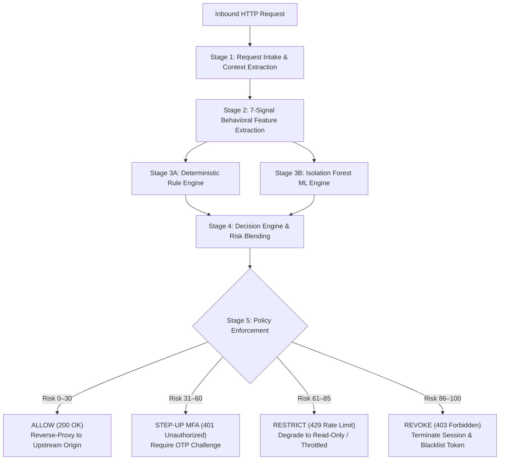

# 🛡️ SentinelX — Adaptive Zero Trust Runtime API Security Gateway

[](https://opensource.org/licenses/MIT)
[](https://www.python.org/)
[](https://fastapi.tiangolo.com)
[](https://react.dev)
[](https://www.docker.com/)

> **Autonomous, Real-Time Behavioral Anomaly Detection & Continuous Policy Enforcement for Distributed Microservices**  
> *Evaluates risk and enforces adaptive Zero Trust authorization on every in-flight HTTP request in under 5ms using Hybrid Unsupervised ML and Deterministic Security Rules.*

---

## 📌 Table of Contents

- [Executive Overview](#-executive-overview)
- [The Core Problem](#-the-core-problem-static-tokens-vs-runtime-zero-trust)
- [How SentinelX Works](#-how-sentinelx-works)
- [System Architecture & Request Pipeline](#-system-architecture--request-pipeline)
- [The 7-Signal Behavioral Feature Vector](#-the-7-signal-behavioral-feature-vector)
- [Adaptive 4-Tier Policy Enforcement](#-adaptive-4-tier-policy-enforcement)
- [Interactive Management Portals](#-interactive-management-portals)
- [Repository Structure](#-repository-structure)
- [Getting Started & Quickstart](#-getting-started--quickstart)
  - [Prerequisites](#prerequisites)
  - [Option 1: One-Click Startup (Python)](#option-1-one-click-startup-recommended-for-local-evaluation)
  - [Option 2: Docker Compose Deployment](#option-2-docker-compose-deployment)
  - [Option 3: Manual Component Startup](#option-3-manual-component-startup)
- [Configuration & Environment Variables](#-configuration--environment-variables)
- [API Reference](#-api-reference)
- [Verification & Testing Suite](#-verification--testing-suite)
- [Performance & Production Readiness](#-performance--production-readiness)
- [License](#-license)

---

## 📌 Executive Overview

Modern web applications and distributed microservices rely almost exclusively on static authentication artifacts: JSON Web Tokens (JWT), OAuth2 bearer tokens, and static API keys. Once minted, these tokens are blindly trusted by downstream services until they expire—often hours, days, or weeks later.

If an authenticated token is stolen, intercepted via malware, or abused by an insider, traditional API gateways and Web Application Firewalls (WAFs) fail to detect the breach because the incoming request presents valid credentials.

**SentinelX** resolves this architectural blindspot by operating as an **adaptive, real-time Zero Trust API Gateway**. Rather than assuming that a valid token implies benign intent, SentinelX continuously inspects the multidimensional behavioral context of every inbound call:
- **Who** is making the request (identity, role, historical baseline)
- **What** endpoint and HTTP verb are being accessed (sensitivity, access novelty)
- **Where** the connection originates from (geographic IP drift, subnet shifts)
- **When** the call occurs (time-of-day deviations)
- **How** the request is structured (payload size distributions, device user-agents, request frequency)

SentinelX scores and enforces policy in **under 5 milliseconds**, sitting directly in the live request path without creating noticeable overhead.

---

## 🔍 The Core Problem: Static Tokens vs. Runtime Zero Trust

```
Traditional API Architecture (Static Trust):
Client (Bearer JWT) ─────────► [ Legacy API Gateway ] ─────────► [ Upstream Service ]
                               (Checks expiry only)
                        ⚠️ Token Stolen? Gateway allows it!
                        ⚠️ Sensitive route probed? Allowed!
                        ⚠️ Impossible travel from Russia? Allowed!
```

```
SentinelX Architecture (Continuous Runtime Zero Trust):
Client (Bearer Token) ───────► [ SentinelX Gateway (<5ms) ]
                                      │
              ┌───────────────────────┼───────────────────────┐
              ▼                       ▼                       ▼
      Risk Score 0-30         Risk Score 31-60        Risk Score 86-100
       [ ALLOW 200 ]          [ STEP-UP MFA 401 ]       [ REVOKE 403 ]
      Forward to Origin       Issue OTP Challenge      Kill Session Instantly
```

### Critical Threat Vectors Mitigated
1. **Token Theft & Replay**: An attacker steals an active session token and replays it from a foreign IP or different user agent. SentinelX flags geographic and device deviations immediately.
2. **Privilege Escalation & API Enumeration**: A compromised low-privilege identity suddenly attempts to invoke administrative, user management, or billing routes. SentinelX catches endpoint novelty and role mismatch.
3. **Automated Scraping & Brute Force**: Scripted bursts and credential stuffing trigger request frequency velocity anomalies.
4. **Data Exfiltration & Payload Tampering**: A client sending unexpectedly large requests or unexpected payload volumes is flagged via real-time Z-score analysis.

---

## 🧠 How SentinelX Works

SentinelX combines two complementary evaluation models in parallel:

1. **Deterministic Rule Engine**: High-confidence, zero-latency security rules that detect hard violations (e.g., impossible travel, blacklisted sessions, revoked token reuse, and unauthorized administrative endpoint calls).
2. **Unsupervised Machine Learning Engine**: An in-memory **Isolation Forest** model trained on continuous behavioral distributions. It detects subtle, high-dimensional anomalies and statistical drift that rigid rule-based systems overlook.

A dynamic **Decision Engine** blends both outputs into a unified Risk Score ($0 - 100$):

$$\text{Composite Risk} = \begin{cases} \max(\text{Rule Score}, \text{ML Score}) & \text{if a hard security rule fires} \\ (0.55 \times \text{ML Score}) + (0.45 \times \text{Rule Score}) & \text{otherwise} \end{cases}$$

---

## 🏗️ System Architecture & Request Pipeline



### The 5-Stage Request Lifecycle
1. **Request Intake**: Intercepts HTTP headers (`x-identity-id`, `x-session-id`, `User-Agent`, `x-forwarded-for`), payload size, and routing path into a strongly-typed `RequestContext`.
2. **Feature Extraction**: Compares the inbound call against rolling historical baselines stored in Redis or the in-memory state store to compute the 7-dimensional behavioral vector.
3. **Parallel Scoring**: Runs the deterministic rule checks and the Isolation Forest inference in parallel ($< 2\text{ms}$).
4. **Decision Blending**: Calculates the composite risk score ($0–100$) and generates human-readable reasoning explanations for security auditing.
5. **Enforcement & Forwarding**: Permitted calls are proxied transparently to upstream microservices. Anomalous calls are challenged, throttled, or rejected at the perimeter.

---

## 📊 The 7-Signal Behavioral Feature Vector

| # | Signal Dimension | Normal Baseline | Anomalous Trigger | Security Rationale |
|:---:|:---|:---:|:---:|:---|
| **1** | **Request Frequency** | $1 - 10\text{ req/min}$ | $\ge 30\text{ req/min}$ | Detects automated scrapers, brute force, and credential stuffing attacks. |
| **2** | **Endpoint Novelty** | $0.0$ (Known route) | $1.0$ (First-time route) | Identifies reconnaissance, vulnerability probing, or privilege escalation. |
| **3** | **Geographic Drift** | $0.0$ (Familiar region) | $1.0$ (Novel location) | Catches Impossible Travel and tokens replayed across distant geographies. |
| **4** | **Device Change** | $0.0$ (Recognized UA) | $1.0$ (New User-Agent) | Flags token exfiltration and session hijacking to unauthorized client machines. |
| **5** | **Temporal Deviation** | $0.0 - 0.2$ (Normal hours) | $> 0.5$ (Off-hours) | Flags automated or unauthorized access occurring outside regular identity hours. |
| **6** | **Payload Size Z-Score**| $0.0 - 1.5$ ($200 - 800\text{ B}$) | $> 3.0$ ($> 5\text{ KB}$) | Detects payload injection, buffer exploits, or large-scale data exfiltration. |
| **7** | **Token / Session Age**| $300 - 3600\text{ s}$ | $< 10\text{ s}$ or $> 12\text{ h}$ | Differentiates freshly minted stolen tokens from established, verified sessions. |

---

## 🚦 Adaptive 4-Tier Policy Enforcement

SentinelX moves beyond binary allow/deny decisions with an adaptive four-tier posture:

| Tier | Risk Range | HTTP Response | Operational Action |
|:---|:---:|:---:|:---|
| **ALLOW** | $0 - 30$ | `200 OK` | The request is transparently proxied to the target upstream microservice with latency $< 5\text{ms}$. |
| **STEP-UP MFA** | $31 - 60$ | `401 Unauthorized` | The client is challenged to complete multi-factor authentication (OTP). Upon successful verification, normal access resumes. |
| **RESTRICT** | $61 - 85$ | `429 Too Many Requests` | Access is throttled, restricted to safe read-only operations, or subjected to heightened rate-limiting. |
| **REVOKE** | $86 - 100$ | `403 Forbidden` | Critical compromise detected. The session token is permanently invalidated in the state store and subsequent requests are blocked. |

Policy thresholds are dynamic and hot-reloadable at runtime via the Control Plane API without service interruption.

---

## 🖥️ Interactive Management Portals

SentinelX includes a responsive web interface built with React, Vite, and Lucide icons:

### 1. Security Operations Center (SOC) Console (`/portal`)
- **Live Command Center**: Real-time traffic throughput, percentile latency charts, active user counts, and session state.
- **Incident & Alert Ledger**: Chronological threat log detailing severity, offending identity, triggering signal dimensions, and automated actions taken.
- **Dynamic Policy Manager**: Hot-reloadable threshold sliders allowing security administrators to fine-tune `ALLOW`, `STEP-UP`, and `REVOKE` cutoffs in real time.
- **Interactive Security Sandbox**: Real-time traffic emulator to simulate diverse attacks and visualize gateway responses.

### 2. User & Student Self-Service Portal
- **Identity Profile & Risk Status**: Gives end users clear visibility into their security standing and active sessions.
- **Activity & Access Log**: Transparent history of API interactions and geographic logins.
- **Security Notifications**: Real-time alerts notifying users of step-up verification events or unusual location logins.

---

## 📂 Repository Structure

```
sentinelx/
├── gateway/                    # SentinelX Zero Trust Gateway Service
│   ├── app/
│   │   ├── main.py             # FastAPI gateway entrypoint & router integration
│   │   ├── config.py           # Application settings & environment configuration
│   │   ├── models.py           # Pydantic data schemas & request context models
│   │   ├── proxy.py            # High-performance async reverse proxy forwarding
│   │   ├── features.py         # 7-signal behavioral feature extraction engine
│   │   ├── rules.py            # Deterministic hard-trigger security rule engine
│   │   ├── ml_engine.py        # Lightweight Isolation Forest anomaly detector
│   │   ├── decision.py         # Decision engine & dynamic risk score calculator
│   │   ├── intelligence.py     # Explainable AI reason generator for alerts
│   │   ├── state_store.py      # Redis & thread-safe in-memory state store
│   │   ├── auth.py             # JWT token handling & identity validation
│   │   ├── agents.py           # Background monitoring & threat triage agents
│   │   ├── incidents.py        # Incident tracking and audit ledger
│   │   ├── routers/            # Modular FastAPI route controllers
│   │   │   ├── gateway.py      # Data-plane reverse proxy router
│   │   │   ├── sentinelx.py    # Control-plane telemetry & policy router
│   │   │   ├── auth.py         # User authentication & registration router
│   │   │   ├── dashboard_api.py# SOC and user portal backend endpoints
│   │   │   ├── incidents_router.py
│   │   │   └── telemetry_router.py
│   │   └── seed/               # Synthetic traffic generation & model pre-warming
│   ├── tests/                  # Gateway unit and integration tests
│   ├── Dockerfile              # Production Dockerfile for gateway
│   └── requirements.txt        # Gateway Python dependencies
│
├── demo-service/               # Upstream Mock Microservice (Origin)
│   ├── app/                    # Origin application simulating production APIs
│   ├── Dockerfile              # Container definition for demo service
│   └── requirements.txt        # Demo service dependencies
│
├── portal/                     # React + Vite SOC & User Web Portal
│   ├── src/
│   │   ├── admin/              # SOC Admin components (AlertFeed, PolicyControl, etc.)
│   │   ├── student/            # User/Student self-service dashboard components
│   │   ├── auth/               # Authentication views (Login, Register)
│   │   ├── components/         # Reusable UI widgets & Risk Gauges
│   │   └── api/                # Unified HTTP API client
│   ├── package.json            # Node.js dependencies
│   └── vite.config.js          # Vite build configuration
│
├── docker-compose.yml          # Multi-container orchestration (Gateway + Origin + Redis)
├── start_all.py                # Single-command Python development bootstrapper
├── test_e2e_suite.py           # Complete end-to-end integration test runner
├── load_test.py                # High-concurrency async load test script
├── render.yaml                 # Cloud deployment specification
└── README.md                   # Project documentation
```

---

## 🚀 Getting Started & Quickstart

### Prerequisites
- **Python**: Version 3.10 or higher
- **Node.js**: Version 18 or higher (optional for building the portal)
- **Docker & Docker Compose**: Optional (recommended for containerized deployment)

---

### Option 1: One-Click Startup (Recommended for Local Evaluation)

Run the bootstrapper script from the repository root:

```bash
python start_all.py
```

This script will automatically:
1. Install dependencies for `demo-service` and launch it on port `9000`.
2. Install dependencies for `gateway` and launch the SentinelX Gateway on port `8080`.

Once running, access the portal in your browser:
👉 **[http://localhost:8080](http://localhost:8080)**

---

### Option 2: Docker Compose Deployment

To boot the complete distributed architecture including a dedicated Redis 7 cluster:

```bash
docker compose up --build
```

Services will be provisioned on:
- **SentinelX Gateway**: `http://localhost:8080`
- **Origin Microservice**: `http://localhost:9000`
- **Redis Cache & State Store**: `localhost:6379`

---

### Option 3: Manual Component Startup

#### 1. Start Upstream Demo Service
```bash
cd demo-service
pip install -r requirements.txt
uvicorn app.main:app --host 0.0.0.0 --port 9000
```

#### 2. Start SentinelX Gateway
```bash
cd gateway
pip install -r requirements.txt
uvicorn app.main:app --host 0.0.0.0 --port 8080
```

#### 3. Start Frontend Portal (Development Mode)
```bash
cd portal
npm install
npm run dev
```
The React development server runs at `http://localhost:5173`.

---

## ⚙️ Configuration & Environment Variables

SentinelX is configured through standard environment variables or a `.env` file:

| Variable | Default Value | Description |
|:---|:---:|:---|
| `SENTINELX_ORIGIN_BASE_URL` | `http://localhost:9000` | Target URL of upstream microservices being protected. |
| `SENTINELX_REDIS_URL` | *(None — In-Memory)* | Redis connection string (e.g. `redis://localhost:6379/0`). Falls back to thread-safe in-memory store if unset. |
| `SENTINELX_ENVIRONMENT` | `development` | Operating environment (`development`, `staging`, `production`). |
| `PORT` | `8080` | Port for the SentinelX Gateway listener. |
| `JWT_SECRET_KEY` | `sentinelx-dev-secret-key-32chars` | Secret key used for signing session tokens and API claims. |
| `JWT_ALGORITHM` | `HS256` | Cryptographic algorithm for JWT verification. |

---

## 📡 API Reference

### Data Plane (Reverse Proxy)
All incoming application traffic passes through the data plane:
- **`ANY /gateway/{service}/{path}`**: Intercepts, extracts behavioral vectors, executes scoring, and reverse-proxies allowed requests to the upstream origin service.
- **`ANY /{path}`**: Fallback reverse proxy transparently forwarding standard endpoints (e.g., `/profile`, `/orders`, `/payments/transfer`).

### Control Plane Endpoints
| Method | Endpoint | Description |
|:---|:---|:---|
| `GET` | `/health` | Gateway health check and service readiness status. |
| `GET` | `/sentinelx/stats` | Gateway latency telemetry, identity counts, and active storage backend. |
| `GET` | `/sentinelx/policy` | Returns current policy risk thresholds (`allow`, `step_up`, `restrict`). |
| `POST` | `/sentinelx/policy` | Hot-reloads risk thresholds dynamically at runtime. |
| `GET` | `/sentinelx/risk/{identity_id}` | Retrieves current risk state, feature vector, and access history for an identity. |
| `POST` | `/sentinelx/revoke/{session_id}` | Instantly invalidates a session across the gateway mesh. |
| `GET` | `/sentinelx/alerts` | Real-time stream of explainable security alerts. |
| `GET` | `/sentinelx/users` | Lists registered user profiles, assigned roles, and baseline metrics. |
| `POST` | `/sentinelx/users` | Registers a new user identity and initializes baseline tracking. |
| `POST` | `/sentinelx/simulate` | Evaluates a simulated scenario through the full 5-stage pipeline. |

### Authentication Endpoints
| Method | Endpoint | Description |
|:---|:---|:---|
| `POST` | `/api/auth/login` | Authenticates user credentials and issues a typed session token. |
| `POST` | `/api/auth/register` | Registers a new identity with default security baselines. |
| `POST` | `/api/dashboard/verify-mfa` | Verifies a one-time passcode (OTP) challenge to satisfy Step-Up MFA. |

---

## 🧪 Verification & Testing Suite

### 1. Automated Unit & Integration Tests
Execute the complete test suite with `pytest`:

```bash
cd gateway
pytest
```

### 2. End-to-End Verification Pipeline
Run the comprehensive verification script against an active gateway instance:

```bash
python test_e2e_suite.py
```
**Test Stages Covered**:
- Gateway health and stats endpoints
- Dynamic user registration and profile validation
- Reverse proxy header preservation and response transparency
- Role-based security matrix evaluation across multiple personas (`admin`, `manager`, `student`)
- Anomaly scenarios (Normal, Privilege Escalation, Impossible Travel, Frequency Bursts)
- Session revocation and post-revocation token blocking
- Dynamic policy threshold hot-reloading
- 7-signal feature vector integrity validation

### 3. High-Concurrency Async Load Test
Benchmark gateway throughput and latency under stress:

```bash
python load_test.py
```
Fires 2,000 asynchronous concurrent requests across multiple identities to evaluate:
- Sub-5ms p50/p95 latency enforcement
- System throughput (reqs/second)
- Real-time policy distribution across risk tiers

---

## ⚡ Performance & Production Readiness

### Low Latency Budget (< 5ms)
SentinelX is engineered to sit directly in the hot request path:
- **Vector Extraction**: $O(1)$ deque and rolling Exponentially Weighted Moving Average (EWMA) lookups ($\approx 0.8\text{ms}$).
- **ML Inference**: Pre-warmed scikit-learn Isolation Forest executed in memory ($\approx 0.5\text{ms}$).
- **Deterministic Rules**: Direct integer and bitwise comparisons ($\approx 0.2\text{ms}$).
- **Total Overhead**: Typically $< 2.0\text{ms}$, well below typical 10ms enterprise SLA limits.

### Graceful Degradation
If the primary Redis cluster encounters downtime or network partitioning, SentinelX automatically transitions into a thread-safe in-memory cache without dropping client connections or returning `500 Internal Server Error` responses.

---

## 📄 License

This project is licensed under the [MIT License](file:///c:/Users/sughan_7002/OneDrive/Desktop/SentinelX_Hackathon_Prototype/sentinelx/LICENSE).
