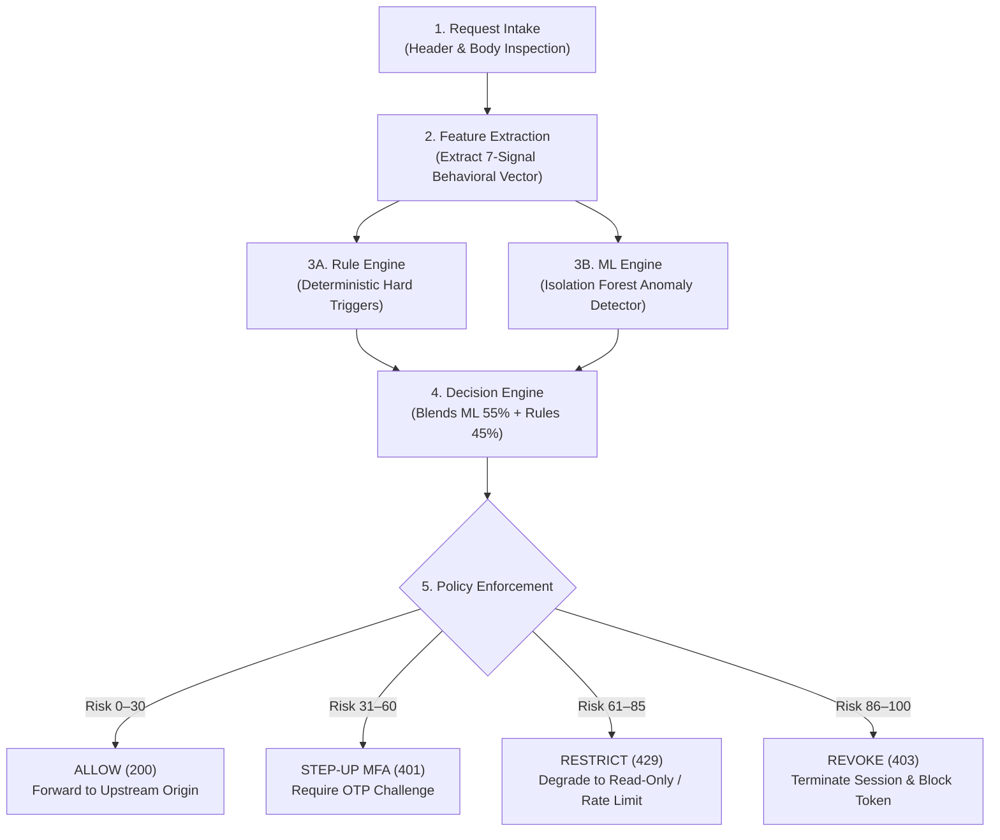

# 🛡️ SentinelX — Adaptive Zero Trust Runtime API Security Gateway

> **Autonomous, Real-Time Behavioral Anomaly Detection & Policy Enforcement for Modern Microservices**  
> *Scoring trust on every in-flight API request in under 5ms using Hybrid Unsupervised ML + Deterministic Rules.*

---

## 📌 Executive Summary

Traditional API security relies on static authentication tokens (JWT / OAuth2 / API Keys). Once a token is issued, it is blindly trusted until expiration—even if stolen, leaked, or used from an unauthorized country for malicious privilege escalation.

**SentinelX** solves this fundamental flaw by placing an **adaptive, real-time Zero Trust gateway** in front of your microservices. Rather than trusting static tokens, SentinelX continuously monitors **who** is calling, **what** endpoint they are hitting, **where** they are connecting from, **when** they are calling, and **how fast** requests arrive.

```
Incoming Request ➔ [ SentinelX Gateway (<5ms) ] ➔ Allow (200) ➔ Upstream Origin Microservice
                          │
                          ├─► Step-Up MFA Challenge (401 OTP)
                          ├─► Rate Restrict / Read-Only (429)
                          └─► Revoke Session Immediately (403)
```

---

## 🏗️ Core Architecture & 5-Stage Request Lifecycle



### The 5 Lifecycle Stages

1. **Request Intake**: Gateway intercepts inbound HTTP calls, parsing caller identity (`x-identity-id`), session (`x-session-id`), IP, source Geo, device user-agent, and payload size into a typed `RequestContext`.
2. **Feature Extraction**: Compares caller behavior against historical rolling baseline in Redis / In-Memory store to compute the **7-dimensional feature vector**.
3. **Parallel Scoring**:
   - **Deterministic Rule Engine**: Instantly flags hard security violations (Impossible Travel, Revoked Token reuse, Frequency Burst, Unassigned Privilege Escalation).
   - **Isolation Forest ML Engine**: Evaluates high-dimensional behavioral divergence against synthetic normal profiles.
4. **Decision Blending**: Calculates composite risk score ($0–100$) using weighted linear combination or rule override:
   $$\text{Final Score} = \begin{cases} \max(\text{Rule}, \text{ML}) & \text{if hard rule triggered} \\ (0.55 \times \text{ML}) + (0.45 \times \text{Rule}) & \text{otherwise} \end{cases}$$
5. **Enforcement & Forwarding**: Allowed requests are transparently reverse-proxied to the upstream microservice with latency $< 5\text{ms}$. Anomalous requests are challenged or blocked at the perimeter.

---

## 🧠 The 7-Signal Behavioral Feature Vector

| # | Feature | Normal Baseline | Anomalous Trigger | Why it Matters |
|---|---|---|---|---|
| 1 | **Request Frequency** | $1 - 10\text{ req/min}$ | $\ge 30\text{ req/min}$ | Detects automated scrapers, brute force, and credential stuffing. |
| 2 | **Endpoint Novelty** | $0.0$ (Seen before) | $1.0$ (First-ever access) | Identifies reconnaissance or attempts to touch new unassigned APIs. |
| 3 | **Geo Drift** | $0.0$ (Familiar region) | $1.0$ (Unseen location) | Detects account takeover via Impossible Travel (e.g. India $\to$ Russia). |
| 4 | **Device Change** | $0.0$ (Known device) | $1.0$ (New browser/agent) | Identifies token exfiltration to a third-party machine. |
| 5 | **Time Deviation** | $0.0 - 0.2$ (Normal hours) | $> 0.5$ (Off-hours) | Detects unauthorized activity outside user's historical time window. |
| 6 | **Payload Z-Score** | $0.0 - 1.5$ ($200-800\text{ B}$) | $> 3.0$ ($> 5\text{ KB}$) | Flags data exfiltration payloads or payload tampering. |
| 7 | **Token Age** | $300 - 3600\text{ s}$ | $< 10\text{ s}$ or $> 12\text{ h}$ | Distinguishes newly minted stolen tokens from normal active sessions. |

---

## 🎯 How Scenarios Work (Why Different Calls Give Different Scores)

### Case 1: Student `u_alex` hitting `POST /profile` from Local India (IN)
* **What happens**: Normal student checking or updating personal profile.
* **Features**: `Endpoint Novelty = 0`, `Geo Change = 0`, `Frequency = 1/min`.
* **Rule Score**: $0/100$ | **ML Score**: $\approx 18/100$ | **Composite Risk**: $\approx 10/100$
* **Verdict**: `ALLOW` $\to$ Request proxied to Origin with $200\text{ OK}$.

### Case 2: Student `u_alex` hitting `POST /payments/transfer`
* **What happens**: A student account trying to execute a financial transfer or accessing sensitive payment gateways.
* **Features**: `Endpoint Novelty = 1.0` on sensitive prefix `/payments`.
* **Rule Score**: $+60$ (Privilege Escalation Rule) | **Composite Risk**: $60/100$
* **Verdict**: `STEP-UP MFA` $\to$ Gateway returns $401\text{ Unauthorized}$ requiring OTP verification before proceeding.

### Case 3: Student `u_alex` hitting `GET /admin/users`
* **What happens**: A student trying to query all users or admin management endpoints.
* **Features**: `Endpoint Novelty = 1.0` on `/admin` for non-admin role.
* **Rule Score**: $+60$ | **Composite Risk**: $60-75/100$
* **Verdict**: `STEP-UP` / `RESTRICT` $\to$ Gateway denies access to administrative resources.

### Case 4: Administrator `u_admin` hitting `POST /admin/add_user`
* **What happens**: Authorized admin adding a new student or manager in the User Registry.
* **Features**: Administrator role verified $\to$ Admin endpoints authorized in baseline.
* **Rule Score**: $0/100$ | **ML Score**: $\approx 15/100$ | **Composite Risk**: $< 30/100$
* **Verdict**: `ALLOW` $\to$ User created in SQLite database and state store seamlessly.

### Case 5: Impossible Travel (`u_alex` connecting from Russia `RU-MOW`)
* **What happens**: Token was stolen and replayed from an anomalous foreign IP.
* **Features**: `Geo Change = 1.0`, `Device Change = 1.0` after established Indian history.
* **Rule Score**: $+75$ (Impossible Travel Hard Trigger) | **Composite Risk**: $> 85/100$
* **Verdict**: `REVOKE` $\to$ Connection immediately terminated, session destroyed.

---

## ⚡ Fast-Start Setup

### Prerequisites
- Python 3.9+ (Python 3.10+ recommended)
- Optional: Docker & Docker Compose (for production Redis deployments)

### 1-Click Launch (All Services)
From the repository root:
```bash
python start_all.py
```
This automatically installs dependencies, boots the **Origin Demo Service** on port `9000`, and launches the **SentinelX Gateway** on port `8080`.

Open your browser at:
👉 **[http://localhost:8080](http://localhost:8080)**

---

## 🧪 Automated End-to-End Test Suite

Verify all 9 pipeline stages with the built-in test runner:
```bash
python test_pipeline.py
```
**Test Stages Verified**:
1. Service Health Checks (`/health`)
2. Control-Plane Telemetry (`/sentinelx/stats`, `/sentinelx/policy`)
3. Normal Traffic Proxying (`ALLOW` $\to$ Upstream $200\text{ OK}$)
4. Impossible-Travel Hard Trigger Detection
5. Privilege Escalation Defense (Novel sensitive endpoint access)
6. Session Revocation & Post-Revocation Token Reuse Detection
7. Simulator Scenarios (All 5 anomaly patterns)
8. Explainable Alert Feed & Incident Ledger Integrity
9. Dynamic Policy Threshold Mutation at Runtime

---

## 🎤 2-Minute Hackathon Demo Script

Follow this script during judge presentations for maximum impact:

1. **The Hook (0:00 - 0:30)**:
   - *"Static JWT tokens are broken. If an attacker steals an API token, standard gateways let them through until it expires. SentinelX brings Zero Trust down to the runtime request level."*
2. **Normal Flow (0:30 - 0:50)**:
   - In the **Console tab**, select `u_alex` (Student). Select `/profile`, Method `POST`, Location `Local (IN)`.
   - Click **Send Request ➔**. Show the green **ALLOW** badge and live latency ($< 5\text{ms}$).
3. **Privilege Escalation & MFA Challenge (0:50 - 1:15)**:
   - Change the endpoint to `/payments/transfer`. Click **Send Request ➔**.
   - Show the gauge jump to **Step-Up (60/100)**: SentinelX caught a student attempting unauthorized payment transfers and issued an MFA challenge!
4. **Impossible Travel Anomaly (1:15 - 1:35)**:
   - Change Location to **Anomalous (RU)**. Click **Send Request ➔**.
   - Show the red **REVOKE** verdict: SentinelX terminated the hijacked session instantly.
5. **Live ML Pipeline (1:35 - 2:00)**:
   - Switch to the **ML Pipeline tab**: Show the live 5-stage animation and dynamic 7-signal feature vector bars updating in real time!

---

## 🛡️ Judge Q&A Defense & Architectural Cheat Sheet

<details>
<summary><strong>Q: How do you achieve sub-5ms latency with ML in the hot path?</strong></summary>

SentinelX uses a lightweight, pre-warmed **Isolation Forest** coupled with compact, in-memory rolling EWMA deques (O(1) lookups). Feature vector normalization and inference execute in under $1.5\text{ms}$, well within standard API latency budgets.
</details>

<details>
<summary><strong>Q: How does SentinelX handle Cold Start for new users?</strong></summary>

New identities without historical baselines are handled with grace: initial common requests (`/profile`, `/orders`) start with neutral novelty ($0.0$). As the identity accumulates requests, their personalized baseline converges automatically.
</details>

<details>
<summary><strong>Q: How do you train without labeled attack datasets?</strong></summary>

Real attack patterns vary constantly. SentinelX utilizes **unsupervised anomaly detection** (Isolation Forest) trained on synthetic normal behavioral distributions. Rather than searching for known attacks, it flags statistical divergence from expected human & service baselines.
</details>

<details>
<summary><strong>Q: Can policy thresholds be changed dynamically without downtime?</strong></summary>

Yes! The sliders in the console and the `POST /sentinelx/policy` endpoint mutate enforcement thresholds in real time without restarting servers or dropping existing connections.
</details>

---

## 📡 API Reference Cheatsheet

### Control Plane Endpoints
- `GET  /sentinelx/stats` — Latency budget, active identities, store backend.
- `GET  /sentinelx/risk/{identity_id}` — Current risk state and request count.
- `GET  /sentinelx/policy` — Current policy thresholds (`allow`, `step_up`, `restrict`).
- `POST /sentinelx/policy` — Dynamically update policy thresholds.
- `POST /sentinelx/revoke/{session_id}` — Instantly invalidate a session token.
- `GET  /sentinelx/alerts` — Real-time explainable alert log.
- `GET  /sentinelx/users` — List registered identities and roles.
- `POST /sentinelx/users` — Add a user and initialize baseline.
- `POST /sentinelx/simulate` — Evaluate custom scenarios through the pipeline.

### Data Plane (Proxy)
- `ANY  /gateway/{service}/{path}` — Intercepts and scores traffic, then proxies to upstream if allowed.

---

## 📄 License
MIT License. Built with pride for the Hackathon Prototype Showcase.
